# INSK Trend Forecast

> **한국어 AI 뉴스 도메인 Temporal-aware Hybrid Retrieval 기반 RAG 성능 최적화 연구**
> Embedding 모델, Cross-encoder Reranker, 시간 가중치의 정량 ablation + Failure Case Analysis

상명대학교 시계열 데이터 수업 팀프로젝트 (2026-1학기, 1조).
운영 중인 뉴스 분석 시스템 [INSK](https://github.com/gm-15/INSK)에서 export한 한국어 AI 산업 뉴스 코퍼스를 사용해, RAG의 검색, 재정렬, 생성 단계를 분리해 정량, 정성으로 측정한다.

**팀원**: 길현빈, 박건우, 심상묵, 황정민

---

## 🎯 연구 질문과 결론

> **"왜 뉴스 검색 시스템은 사용자가 원하는 기사를 못 찾아오는가?"**

검색, 재정렬, 생성 3단계를 분리해 측정한 결과, **Reranker(MRR 0.43→0.81)와 생성(환각 거의 없음)은 충분했으나, 1차 검색의 상한(Recall@10 ≈ 0.54)이 전체 성능의 천장으로 작용**했다. 실패 사례 분석에서도 회피의 다수 원인이 검색 단계였다. 즉 **성능 개선의 핵심은 검색 품질**임을 데이터로 진단하였다.

뉴스 검색의 3가지 구조적 실패를 가설로 잡았다: ① 의미 혼동, ② 오래된 기사, ③ 키워드 불일치. 이를 **Hybrid Retrieval → Cross-encoder Reranker → Temporal Weighting → LLM 생성**의 4단계 파이프라인으로 단계적으로 다루고 각 단계의 기여를 분리 측정한다.

---

## 1. 데이터셋

### 1.1 뉴스 코퍼스
INSK가 Naver News API, AI Times RSS, The Guru RSS 3개 소스에서 수집하고, URL, 제목 Jaccard로 중복 제거 후 LLM으로 분류, 요약한 코퍼스를 사용한다. 총 616건, 분포는 AI Business 55%, INFRA 18%, LLM, Telco 각 13%.

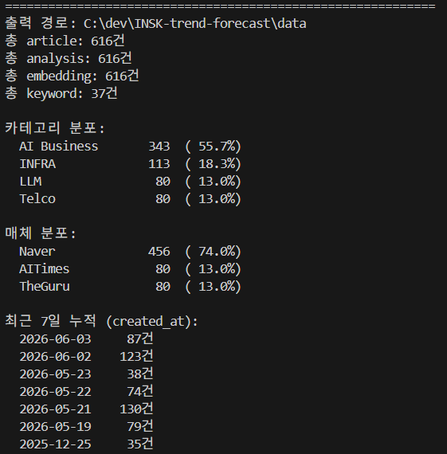
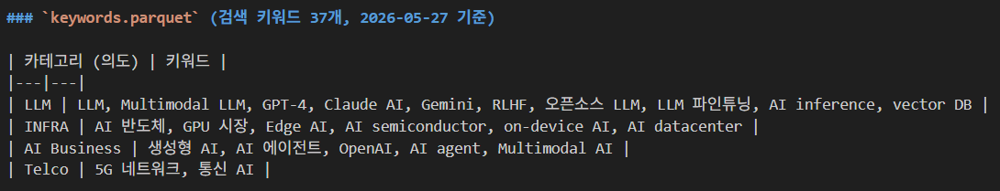

### 1.2 QA 평가셋 (정답 실재성 검증)
정답지가 부실하면 검색 실패가 모델 탓인지 정답지 탓인지 구분할 수 없다. 따라서 질문 50개를 작성한 뒤 각 질문의 정답이 코퍼스에 실재하는지 검색으로 검증하여, 최종 **27개**(Strict 7 / Trend 14 / Negative 6)를 확정하였다. 코퍼스에 답이 없는 현실적 질문은 버리지 않고 **Negative QA**로 채택해 환각, 회피 측정에 활용한다.

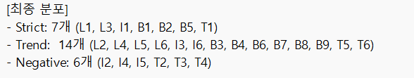
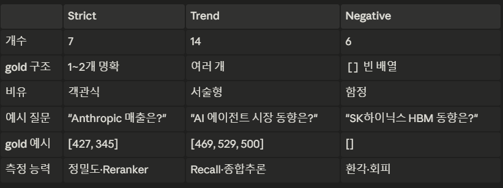
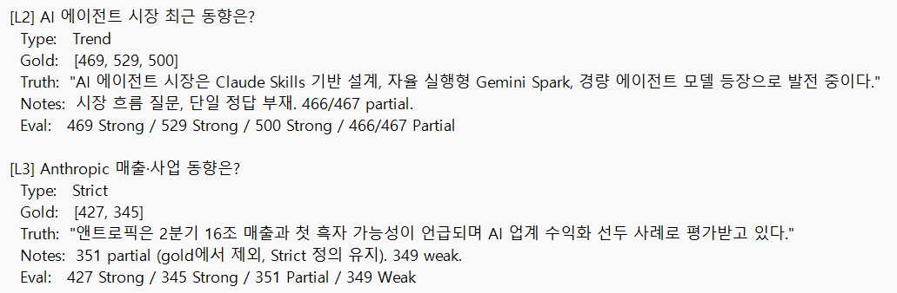

---

## 2. 실험 결과

### 2.1 검색 모델 비교 (5종)
BM25(키워드), OpenAI, BGE-M3, ko-sroberta(의미 임베딩), 그리고 BM25+임베딩 융합 Hybrid를 Recall@5, MRR, nDCG@5로 비교했다. **Hybrid가 전체 1위, 범용 유료 OpenAI 임베딩이 가장 낮았다.** 한국어 AI 뉴스 도메인에서는 도메인 특화 오픈소스 모델이 더 강했다.

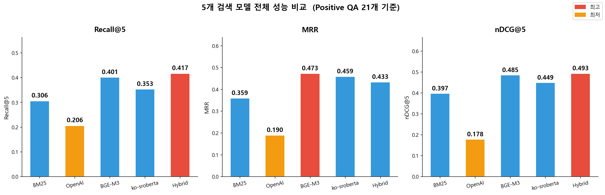

### 2.2 질문 유형별 강점 분석
질문 특성에 따라 강한 모델이 달랐다. 키워드형은 Hybrid, 의미형은 BGE-M3, 한국어 회사명("삼성전자")은 ko-sroberta가 0.688로 최고(BM25는 0.06으로 사실상 실패), 영문 기술용어는 BGE-M3가 강했다. 이에 따라 이후 검색 베이스로 **Hybrid**를 채택했다.

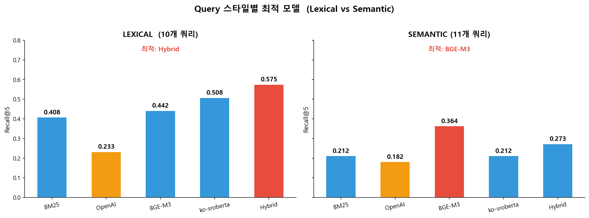
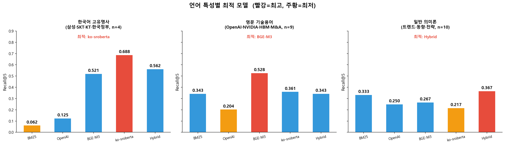

### 2.3 Cross-encoder Reranker 파인튜닝
성능 비교 중 Hard Negative(밀접 오답)를 기록해 질문-오답 쌍 486개를 확보하고, 질문-정답, 질문-오답으로 재구성한 972개 샘플로 한국어 사전학습 모델 `klue/bert-base`를 Cross-encoder로 파인튜닝했다.

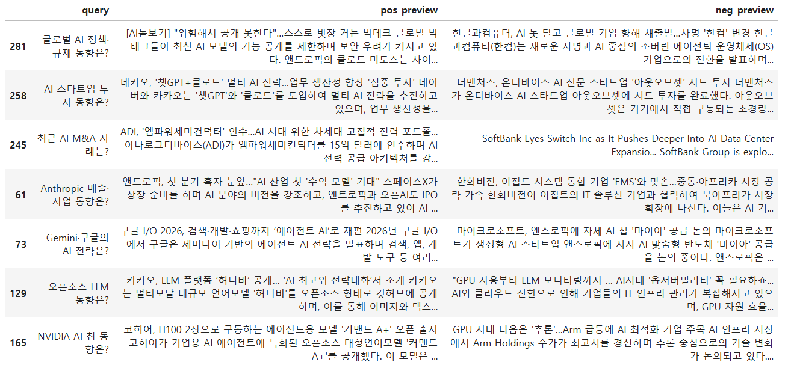
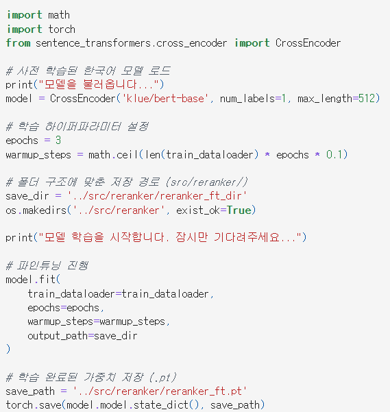

재정렬 효과: **MRR 0.43 → 0.81**, **nDCG 0.344 → 0.601**. 1차 검색 상위 10개 Recall(0.536)이 Reranker가 상위 5개로 추린 뒤에도 동일하게 유지되어, top-10 안의 정답을 top-5로 정확히 끌어올렸음을 확인했다.

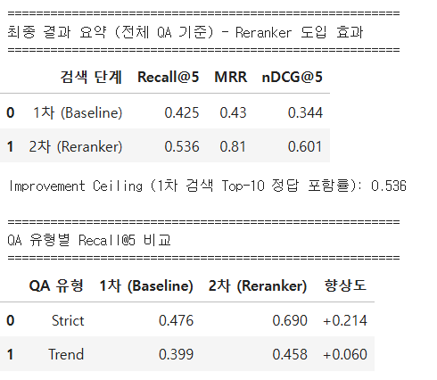

### 2.4 시간 가중치 + RAGAS 평가
뉴스의 최신성을 반영하기 위해 시간 가중치 `exp(−λ·days_diff)`를 적용(최신 1, 오래될수록 0, 음수 방지 최소값 0 고정). 생성 품질은 RAGAS의 Faithfulness, 답변 유사도, Context Precision으로 측정했다.

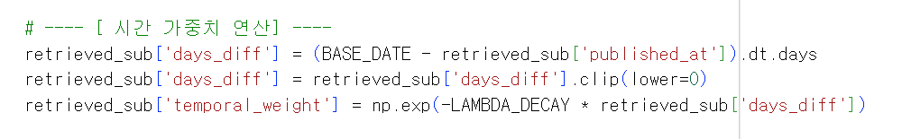
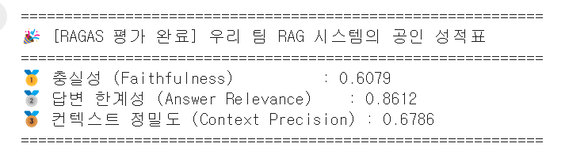

### 2.5 실패 사례 분석 (Failure Case Analysis)
Faithfulness 0점 사례는 대부분 환각이 아니라 "관련 내용을 찾을 수 없다"는 **과도한 회피**였다. 원인이 검색인지 생성인지 구분하기 위해 Context Precision을 함께 확인했다. 총 11건 중 **검색 품질 저하 5건, 생성 단계 실패 2건, 복합 4건**으로, 답변 품질 향상에는 생성뿐 아니라 검색 개선이 함께 필요함을 확인했다.

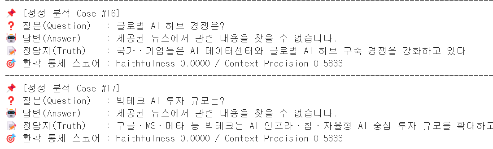
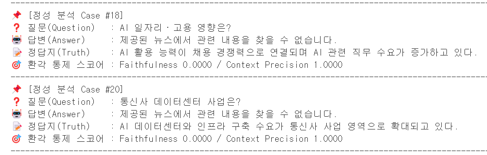

### 2.6 데모
질문 → Hybrid 검색(후보 10개) → Reranker 재정렬 → 근거 인용 답변 생성의 전체 파이프라인을 Streamlit으로 시연했다.

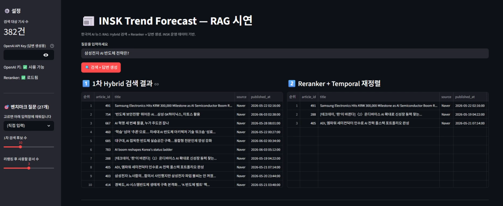
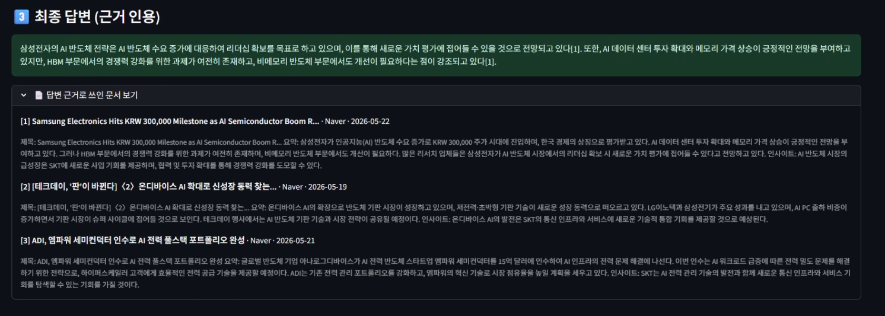

---

## 3. 결론 및 향후 과제

**결론.** Reranker와 생성은 충분했으나 1차 검색의 천장(Recall@10 ≈ 0.54)이 전체 성능을 제한했다. "왜 못 찾는가"의 답은 검색 성능이며, 향후 개선은 검색 단계에 집중되어야 함을 데이터로 진단했다.

**향후 과제.** ① Reranker 후보 풀을 top-10 → top-50으로 확대, ② 기사 본문 확보 및 청크 단위 검색, ③ BGE-M3의 sparse, multi-vector 활용, ④ 질문 특성 기반 모델 라우팅.

**한계.** 코퍼스 616건, QA 27개로는 절대 지표보다 모델 간 상대 비교에 의미가 있으며, 매체 편향(Naver 다수)과 짧은 시계열 구간이 시간 가중치 실험 범위를 제한했다.

---

## 4. 팀 역할

| 역할 | 담당 | 산출물 |
|---|---|---|
| 박건우 (PM, Data) | INSK export, QA benchmark, 데이터 사전, 통합 데모 | `data/`, `app/`, `docs/data_dictionary.md` |
| 팀원 A (Retrieval) | BM25 / 임베딩 3종 / Hybrid + 질문 특성 분석 | `notebooks/01-03` |
| 팀원 B (Reranker) | Hard negative mining + Cross-encoder 파인튜닝 | `notebooks/04-05` |
| 팀원 C (RAG, Eval) | Temporal weighting + RAGAS + Failure Analysis | `notebooks/06-09` |

---

## 5. 실행 방법

```bash
# 환경 (Python 3.10+)
pip install pandas numpy scikit-learn jupyter
pip install sentence-transformers faiss-cpu rank-bm25
pip install openai ragas torch transformers streamlit

# 데이터 로드
python -c "import pandas as pd; print(len(pd.read_parquet('data/insk_corpus.parquet')))"

# 데모 실행 (OpenAI 키 필요)
streamlit run app/streamlit_demo.py
```

데이터 스키마, 알려진 한계는 [docs/data_dictionary.md](docs/data_dictionary.md), 최종 결론 정리는 [docs/final_conclusion.md](docs/final_conclusion.md) 참조.

---

## 6. 참조
- INSK 본체 (백엔드): https://github.com/gm-15/INSK
- 멘토 피드백 changelog: [INSK/MENTOR_FEEDBACK_CHANGELOG.md](https://github.com/gm-15/INSK/blob/main/MENTOR_FEEDBACK_CHANGELOG.md)
